# Eng kerakli Ubuntu komandalari
**_Quyida UBUNTU OT(operatsion tizim) dan mukammal foydalanish uchun eng zarur bo'lgan komandalar bilan qisqacha tanishamiz_**

| Command	| Tavsif                                                                        |
| --------- | ----------------------------------------------------------------------------  |
| ls        |	Mavjud kataloglar(papkalar va fayllar) bilan tanishish                      |
| cd        |	Kataloglar bo'yicha joylashuvni o'zgartirish(Papkaga kirish, papkadan chiqish)                                                                                    |
| mkdir     |	Yangi katalog(papka) yaratish                                               |
| touch     |	Yangi bo'sh fayl yaratish yoki faylni o'zgartirish vaqtini yangilash        |
| cp        |	Fayl yoki katalogdan nusxa olish                                            |
| mv        |	Fayl yoki katalogni ko'chirish yoki nomini o'zgartirish                     | 
| nano      |	Fayllarni yaratish yoki tahrirlash uchun oddiy matn muharriri               |
| cat       |	Fayl mazmunini ko'rsatish(Faylni o'qish)                                    |
| grep      |	Berilgan ko'rsatkich asosida chiqishni tartiblaydi                          | 
| chmod     |	Fayl yoki katalog ruxsatini o'zgartirish                                    | 
| chown     |	Fayl yoki katalog egasini o'zgartirish                                      |
| tar       |	Tar arxiv faylini yaratish yoki chaqirib olish                              |
| zip       |	Zip fayl yaratish                                                           |
| unzip     |	Zip arxiv faylini chiqarib olish                                            | 
| ssh       |	Masofaviy serverga xavfsiz ulanish                                          | 
| ping      |	Tarmoq orqali ikkita qurilma o'rtasidagi ulanishni sinab ko'rish            |
| su        |	Boshqa foydalanuvchi hisobiga o'tish                                        |
| netstat   |	Tarmoq ulanishlari, marshrutlash jadvallari va tarmoq statistikasini ko'rsatish                                                                                  | 
| top       |	Tizim resurslari va davom etayotgan jarayonlarning jonli holatini ko'rsatish|
| free      |	Tizim xotirasidan foydalanish haqidagi ma'lumotlarni ko'rsatish             |
| df        |	Diskdan foydalanish ma'lumotlarini olish                                    |
| kill      |	Jarayonga jarayonni tugatadigan signal yuboradi                             |
| find      |	Berilgan argumentlar asosida fayl yoki katalogni qidiradi                   |
| history   |	Oldindan bajarilgan buyruqlar ro'yxatini oladi                              | 
| apt       |	Ubuntu paket menejeri paketlarni o'rnatish, yangilash va o'chirish uchun ishlatiladi                                                                                 |

**Yuqorida keltirilgan har bir buyruqni(command) Misol orqaliqanday ishlashini ko'rib chiqamiz.**

## 1. ls command(buyrug'i): Mavjud kataloglar(papkalar va fayllar) bilan tanishish imkonini beradi.

Bu eng asosiy buyruqlardan biri va Linux sayohatini boshlashda birinchi navbatda o'ylaydigan narsadir.

Va hech qanday variantsiz foydalanilganda, u joriy ishchi katalogning tarkibini ko'rsatadi:

```sh
ls
```


## Linuxda `ls` buyrug`ida tez-tez ishlatiladigan parametrlar


| Variantlar   | Tavsif                                                                       |
| ------------ | ---------------------------------------------------------------------------- |
| -l	       | fayllar va kataloglar haqida batafsil ma'lumotni aks ettiruvchi uzun format sifatida tanilgan.                                                                            |
| -a	       | Barcha fayllarni ko'rsatish. Ro'yxatga yashirin fayllar va kataloglarni  qo'shing.                                                                                     |
| -t	       | Fayllar va kataloglarni so'nggi o'zgartirish vaqti bo'yicha tartiblang, avval eng so'nggi o'zgartirilganlarini ko'rsating.                                                  |
| -r	       | teskari tartib sifatida tanilgan, bu ro'yxatning standart tartibini o'zgartirish uchun ishlatiladi.                                                               |
| -S	       | Fayllar va kataloglarni o'lchamlari bo'yicha tartiblang, birinchi navbatda eng kattalarini sanang.                                                                       |
| -R	       | Fayllar va kataloglarni, jumladan, quyi kataloglarni rekursiv ro'yxatga kiriting.                                                                                     |
| -i	       | Har bir fayl va katalogning indeks raqamini (inode) ko'rsatadigan inode sifatida tanilgan.                                                                            |
| -g	       | fayl va kataloglarning egasi o'rniga guruh egaligini ko'rsatadigan guruh sifatida tanilgan.                                                                            |
| -h	       | Fayl oʻlchamlarini odam oʻqiy oladigan formatda chop etish                   |
| -d	       | Kataloglarni mazmunini emas, balki o'zlarini ro'yxatlang.                    |


# 2. cd command: Kataloglar bo'yicha joylashuvni o'zgartirish(Papkaga kirish, papkadan chiqish) imkonini beradi
cd - buyrug'i, shuningdek, chdir (katalogni o'zgartirish - _'change directory'_) sifatida ham tanilgan, bu buyruq qatori qobig'i buyrug'i bo'lib, turli xil operatsiyalarda joriy ishchi katalogni o'zgartirish uchun foydalaniladi.

```sh
cd [directory-name]
```

Misol uchun, men katalogimni 'Pictures' ga o'zgartirdim:

```sh
cd Pictures
```

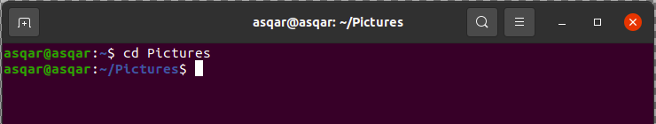

Ortga qaytish uchun :

```sh
cd ..
```

Yuqoridagi kommanda katalog bo'yicha bitta ortga qaytaradi

Va Bundan tashqari 'cd' komandasining o'zi ham ishlatiladi. Ushbu komanda asosiy menu ga qaytaradi:

```sh
cd
```


# 3. mkdir command: Yangi katalog(papka) yaratish imkonini beradi.
mkdir - _("Make Directory")_ "Katalog yaratish" so'zining qisqartmasi. mkdir - bu kataloglarni yaratishda yordam beradigan Linux operatsion tizimlarida buyruq qatoriga asoslangan yordamchi dastur.

```sh
mkdir [directory-name]
```

For example, here, I created a new directory named Examples:

```sh
mkdir Examples
```

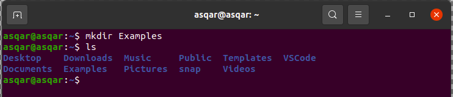

**mkdir**dan foydalanish uchun quyidagi variantlar mavjud

## _1) --help_


## _2) --version_


## _3) -p_

Agar biz katalog ichida katalog yaratmoqchi bo'lsak ushbu ko'rinishdan foydalanamiz

```sh
mkdir -p [katalog1/katalog2/...]
```


# 4. touch command: Yangi bo'sh fayl yaratish yoki faylni o'zgartirish vaqtini yangilash imkonini beradi.


```sh
touch [Filename]
```

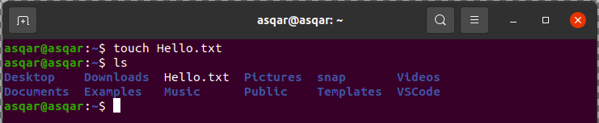

Bir nechta faylni birdan yaratish


# 5. cp command: Fayl yoki katalogdan nusxa olish
cp - (copy) nusxa ko'chirish so'zining qisqartmasi. U boshqa fayl nomi bilan bir xil fayl tasvirini yaratadi. cp buyrug'idan foydalanib fayllaringiz yoki kataloglaringizni bir joydan boshqa joyga nusxalashingiz mumkin.

```sh
cp source_file target_directory
```

Aytaylik, men Hello.txt nomli matn faylini MyFiles katalogiga ko‘chirmoqchiman, keyin quyidagi buyruqdan foydalanishim kerak bo‘ladi:

```sh
cp Hello.txt MyFiles/
```


`cp` buyrug`idan foydalanishda mavjud bo`lgan bir nechta variantlarni ham eslatib o`tamiz: 

`-i`, `-b`, `-f`, `-r`, `-p`.

# 6. mv command: Fayl yoki katalogni ko'chirish yoki nomini o'zgartirishni amalga oshiradi
mv - _('move' - "ko'chirish")_ buyrug'i fayllar va kataloglarni bir katalogdan ikkinchisiga o'tkazadi yoki fayl yoki katalog nomini o'zgartiradi. Agar siz fayl yoki katalogni yangi katalogga ko'chirsangiz, u asosiy fayl nomini saqlab qoladi.

Foydalanish uslubi:
```sh
mv target_file target_directory
```

Masalan, men Hello.txt faylini Docs katalogiga ko'chirdim:
```sh
mv Hello.txt Docs/
```


## `mv` buyrug`ining 2 ta alohida funksiyasi

1) Fayl yoki katalog nomini o'zgartirish.
2) Fayl yoki katalogni boshqa joyga ko‘chirish.

## Linuxda katalog va fayl nomini o'zgartirish 

### Katalog


### File


## Bundan tashqari:


1) '-i' (interaktiv)


# 7. nano command: Fayllarni yaratish yoki tahrirlash uchun oddiy matn muharriri.
Nano oddiy, ammo kuchli buyruq qatoriga asoslangan matn muharriri bo'lib, u oddiy interfeysi tufayli Linuxning boshlang'ich foydalanuvchilari orasida juda mashhur. Buyruqlar qatori muharriri sifatida u murakkabroq grafik matn muharrirlariga yengil muqobil taklif etadi.

```sh
nano Filename
```

Misol uchun,men bu yerda Hello.txt fayliga nano matn muharriri yordamida bir nechta o'zgartirishlar kiritdim:


Yuqoridagi buyruq chiqishda ko'rsatilganidek 'Filename' bilan yangi faylni ochadi. Agar fayl allaqachon mavjud bo'lsa, u xuddi shunday ochiladi va agar fayl joriy katalogda bo'lmasa, u yangisini yaratadi. Oynaning pastki qismida nano uchun yorliqlar ro'yxati mavjud.

1. Faylni saqlash uchun

```sh
press Ctrl + o
```

2. Nano-da imlo tekshiruvini yoqish uchun. Birinchidan, imlo tekshiruvi paketini o'rnating.

```sh
$sudo apt install spell
```

# 8. cat command: Fayl mazmunini ko'rsatish(Faylni o'qish) imkonini beradi.
Matn faylining mazmunini o'qishni xohlagan paytingizda, 'cat' buyrug'i sizga kerak bo'lgan narsadir. cat('concatenate' - 'birlashtirmoq') - standart chiqish ekranida yoki boshqa faylga fayllarni yaratish, birlashtirish yoki chop etish imkonini beradi.

'cat' buyrug'ini ishlatish uchun uni quyidagi tarzda bajarishingiz kerak bo'ladi:

```sh
cat Filename
```


# 9. grep command: Berilgan ko'rsatkich asosida chiqishni tartiblaydi.
grep("global regular expression print" - "global muntazam ifoda chop etish").Bu yerda butun ekranni o'z chiqishi bilan to'ldiradigan turli xil buyruqlar mavjud, shuning uchun u holda siz izlayotgan narsani aniq topish uchun grep buyrug'idan foydalanishingiz mumkin. grep fayldagi mos naqshlarni qidirish uchun foydali buyruqdir.

Bundan tashqari, o'xshash fayllar uchun ham qo'llanilishi mumkin.

Ma'lumot uchun, men Hello.txt faylidan Hello so'zini topish uchun cat buyrug'iga grep buyrug'ini kiritdim:

```sh
cat Hello.txt | grep -w "Hello"
```

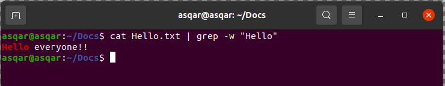

## Qo'shimcha

| Variantlar | tavsifi                                                                      |
| ---------- | ---------------------------------------------------------------------------- |
| -c         | Bu faqat naqshga mos keladigan qatorlar sonini chop etadi                    |
| -h         | mos keladigan satrlarni ko'rsating, lekin fayl nomlarini ko'rsatmang.        |
| -i         | E'tibor bermayapti, mos keluvchi registr                                     |
| -l         | Faqat fayl nomlari ro'yxatini ko'rsatadi.                                    |
| -n         | mos keladigan chiziqlar va ularning qator raqamlarini ko'rsatish.            |
| -v         | Bu naqshga mos kelmaydigan barcha satrlarni chop etadi                       |
| -e exp     | Ushbu parametr bilan ifodani belgilaydi. Bir necha marta foydalanish mumkin. |
| -f file    | Har bir satrda bitta fayldan naqsh oladi.                                    |
| -E         | naqshni kengaytirilgan muntazam ifoda sifatida ko'rib chiqadi (ERE)          |
| -w         | butun so'zni moslang                                                         |
| -o         | mos keladigan chiziqning faqat mos keladigan qismlarini chop eting, har bir bunday qism bilan alohida chiqish liniyasida.                                               |
| | |
| -A n       | Natijadan keyin qidirilgan qator va n qatorlarni chop etadi.                 |
| -B n       | Qidirilgan qatorni va natijadan oldin n qatorni chop etadi.                  |
| -C n       | Qidirilgan qator va natijadan oldin n qatordan keyin chop etadi.             |

# 10. chmod command: Fayl yoki katalog ruxsatini o'zgartirish.
Linux bir nechta foydalanuvchilarga ega bo'lishi uchun yaratilgan va bu holda siz boshqa foydalanuvchilarga shaxsiy fayllaringizga kirishiga ruxsat berishni xohlamasligingiz mumkin.

chmod('change mode' - 'rejimini o'zgartirish') - barcha turdagi foydalanuvchilarga fayl yoki katalog ruxsatlarini o'zgartirish imkonini beruvchi buyruqdir, buyruq yordamida siz faylni o'qish, yozish va bajarish ruxsatini o'zgartirishingiz mumkin.

chmod buyrug'ini ishlatish uchun sizquyida berilgan buyruq sintaksisiga amal qilishingiz kerak:

```sh
chmod [options] mode file(s)
```

Aytaylik, men Hello.sh skriptini bajariladigan qilib yaratmoqchiman, keyin men quyidagilarni ishlataman:

```sh
chmod +x Hello.sh
```
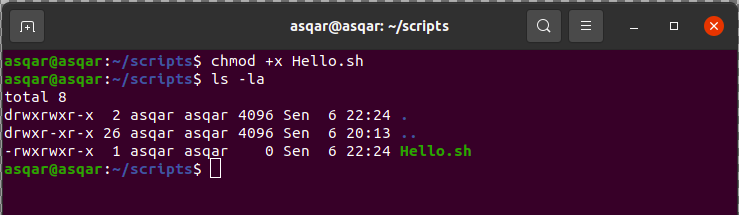

## “chmod” in Linux [options]

| Variantlar |	Tavsif                                                                        |
| ---------- | ------------------------------------------------------------------------------ |
| `-R`	     | Belgilangan katalogdagi barcha fayllar va kataloglarga ruxsatnoma o'zgarishini rekursiv ravishda qo'llang.                                                                   |
| `-v`	     | U qayta ishlangan har bir fayl uchun xabarni ko'rsatadi. ruxsat etilgan  o'zgarishlarni ko'rsatgan holda.                                                              |
| `-c`	     | U "-v" bilan bir xil ishlaydi , lekin bu holda u faqat ruxsati o'zgartirilgan fayllar uchun xabarlarni ko'rsatadi.                                                          |
| `-f`	     | Bu xato xabarlarini ko'rsatishdan qochishga yordam beradi.                     |
| `-h`	     | Belgilangan fayllar o'rniga ramziy havolalar ruxsatlarini o'zgartiring.        |

## 1) Ramziy rejim

| Operatorlar | Ta'rif                                        |
| ----------- | --------------------------------------------- |
| `+`	      | Ruxsat qo'shing                               |
| `-`	      | Ruxsatlarni olib tashlash                     |
| `=`	      | Belgilangan qiymatlarga ruxsatlarni o'rnating |

Ramziy rejimda ishlatilishi mumkin bo'lgan quyidagi harflar:

| Xatlar | Ta'rif         |
| ------ | -------------- |
| `r`	 | O'qish ruxsati |
| `w`	 | Yozish ruxsati |
| `x`	 | Ruxsat berish  |

Qo'llaniladigan quyidagi havolalar:

| Malumot | Sinf                                  |
| ------- | ------------------------------------- |
| u	      | Egasi                                 |
| g	      | Guruh                                 |
| o	      | Boshqalar                             |
| a	      | Hammasi (egasi, guruhlari, boshqalar) |

## Simvolik rejimdan foydalanishga misollar:

Fayl egasiga ruxsatlarni o'qish, yozish va bajarish:
```sh
chmod u+rwx [fayl_nomi]
```

Guruh va boshqalar uchun yozish ruxsatini olib tashlang:
```sh
chmod go-w [fayl_nomi]
```

Egasi uchun oʻqish va yozish, guruh uchun faqat oʻqish uchun va boshqalar:
```sh
chmod u+rw,go+r [fayl_nomi]
```

## 3)Linux da qanday turdagi ruxsatlar bor va ular nimani anglatadi?
Linuxda uchta ruxsat turi mavjud: 

|          |       |
| -------- | ----- |
| o'qish   | (`r`) |
| yozish   | (`w`) |
| bajarish | (`x`) |

Ular qo'llaniladi:
|        |       |
| ------ | ----- |
| egasi  | (`u`) |
| guruh  | (`g`) |
| boshqa | (`o`) |

# 11. chown: Fayl yoki katalog egasini o'zgartirish.
chowndan ('change owner' - 'egasini o'zgartirish') - foydalanib, siz faylning egaligini o'zgartirishingiz mumkin, keyin esa chmod yordamida egasi uchun ruxsatlarni o'zgartirishingiz mumkin.

Chown buyrug'idan foydalanish uchun siz berilgan buyruq sintaksisiga amal qilishingiz kerak:

```sh
chown [OPTIONS] USER[:GROUP] file
```

Misol uchun, bu erda men Hello.txt egaligini ildiz foydalanuvchisiga o'zgartirdim:

```sh
sudo chown root Hello.txt
```

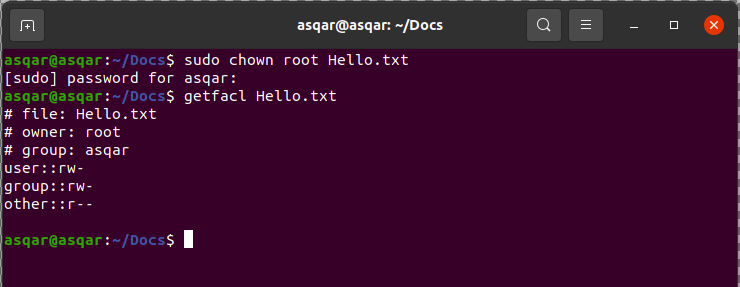

# 12. tar command: Tar arxiv faylini yaratish yoki chaqirib olish imkonini beradi.
tar('Tape Archive' - 'Lenta arxivi') - arxiv fayllarini yaratish va chiqarish uchun ishlatiladi. Arxiv fayli siqilgan fayl bo'lib, u ko'proq qulay saqlash va ko'chirish uchun birlashtirilgan bir yoki bir nechta fayllarni o'z ichiga oladi.

tar buyrug'ini quyidagi tarzda ishlatishingiz kerak bo'ladi:

```sh
tar [options] [archive_name] /target/file/or/directoty
```

Malumot uchun, men Files.tar nomli tar faylini yaratdim, unda Hello.txt va main.py mavjud:


| options | Tavsif                                                                             |
| ------- | ---------------------------------------------------------------------------------- |
| -c      | Fayllar va kataloglarni birlashtirish orqali arxiv yaratadi.                       |
| -x      | Mavjud arxivdan fayllar va kataloglarni chiqaradi.                                 |
| -f      | Yaratiladigan yoki chiqariladigan arxiv fayl nomini belgilaydi.                    |
| -t      | Arxivdagi fayllar va kataloglarni ko'rsatadi yoki ro'yxatlaydi.                    |
| -u      | Mavjud arxivga yangi fayllar yoki kataloglarni arxivlaydi va qo'shadi.             |
| -v      | Arxivlash yoki chiqarish jarayonida batafsil ma'lumotni taqdim etadigan batafsil ma'lumotni ko'rsatadi.                                                                         |
| -A      | Bir nechta arxiv fayllarini bitta arxivga birlashtiradi.                           |
| z       | Tar faylini yaratishda gzip siqishni ishlatadi, natijada ".tar.gz" kengaytmasi bilan siqilgan arxiv olinadi.                                                                  |
| -j      | Tar faylini yaratishda bzip2 siqilishidan foydalanadi, natijada ".tar.bz2"   kengaytmasi bilan siqilgan arxiv olinadi.                                                      |
| -V      | Arxiv faylining yaxlitligini tekshiradi, uning mazmuni buzilmasligini ta'minlaydi. |
| -r      | Butun arxivni qayta yaratmasdan allaqachon mavjud arxivga fayllar yoki kataloglarni yangilaydi yoki qo'shadi.                                                                      |

# 13. zip command: Zip fayl yaratish.
zip - bir nechta fayllarni bitta siqilgan arxiv fayliga siqish imkonini beradi. Keyin unzip buyrug'i yordamida arxiv faylini ochishingiz mumkin. Zip faylini yaratish uchun siz 'zip' buyrug'ini quyidagi tarzda ishlatishingiz kerak bo'ladi:

```sh
zip output_file.zip input_file
```

Masalan, men Hello.zip nomli bir nechta fayllarni o'z ichiga olgan zip faylni yaratdim:

```sh
zip Hello.zip Hello.txt main.py
```


## Linuxda "Zip" buyrug'idagi variantlar
| Variantlar | Tavsif | Sintaksis |
| ---------- | ------ | --------- |
| -d	     | (Arxivdan fayllarni o'chirish): Ushbu parametr zip arxividan ma'lum fayllarni o'chirish imkonini beradi. Zip faylini yaratgandan so'ng, siz -d opsiyasidan foydalanib fayllarni tanlab olib tashlashingiz mumkin. | zip -d [fayl_name.zip] [fayllar_nomi] |
| -u         | (Arxivdagi fayllarni yangilash): -u opsiyasi mavjud zip arxividagi fayllarni yangilash imkonini beradi. Yangilash yoki arxivga yangi fayllar qo'shish uchun fayllar ro'yxatini belgilashingiz mumkin. Yangilanish faqat o'zgartirilgan versiya zip arxividagidan yangiroq bo'lsa sodir bo'ladi. | zip -u [fayl_name.zip] [fayllar_nomi] |
| -m         | (Fayllarni arxivga ko'chirish): -m opsiyasi yordamida siz ko'rsatilgan fayllarni zip arxiviga ko'chirishingiz mumkin. Ushbu operatsiya, shuningdek, zip arxivini yaratgandan so'ng maqsadli kataloglarni yoki fayllarni o'chiradi. Agar fayllar o'chirilgandan so'ng katalog bo'sh bo'lib qolsa, u ham o'chiriladi. Ushbu parametrdan ehtiyotkorlik bilan foydalaning, chunki u kirish fayllarini butunlay o'chirib tashlaydi | zip -m [fayl_name.zip] [fayllar_nomi] |
| -r         | (Katalogni rekursiv ziplash): -r opsiyasi katalog va uning fayllarini rekursiv ziplash imkonini beradi. U ko'rsatilgan katalogdagi barcha fayllarni va natijada olingan zip arxividagi uning pastki kataloglarini o'z ichiga oladi | zip -r [fayl_name.zip] [katalog_nomi] |
| -x	     | (Fayllarni zip-dan chiqarib tashlash): -x opsiyasidan foydalanib, ma'lum fayllarni zip arxiviga qo'shishni istisno qilishingiz mumkin. Bu katalogdagi barcha fayllarni zip qilmoqchi bo'lsangiz, lekin ba'zi kiruvchi fayllarni chiqarib tashlamoqchi bo'lsangiz foydali bo'ladi. | zip -r [fayl_name.zip] -x [katalog_nomi] |
| -v         | (Verbose mode): -v opsiyasi siqilish vaqtida diagnostika ma'lumotlarini taqdim qilib, batafsil rejimni yoqadi. U taraqqiyot indikatorini ko'rsatadi va zip fayl tuzilishi haqida batafsil diagnostika ma'lumotlarini taqdim etadi. Faqatgina foydalanilganda, u zip fayli va maqsadli muhit haqidagi tafsilotlar bilan diagnostika ekranini chop etadi. | zip -v [fayl_name.zip] [fayl_nomi] |

# 14. unzip command: Zip arxiv faylini chiqarib olish.
unzip - odatda MS-DOS tizimlarida mavjud bo'lgan ZIP arxividan fayllarni ro'yxatga oladi, sinab ko'radi yoki chiqaradi. Standart xatti-harakat (hech qanday variantsiz) belgilangan ZIP arxividagi barcha fayllarni joriy katalogga (va uning ostidagi pastki kataloglarga) chiqarishdir.

berilgan sintaksisga amal qilishingiz kerak:

```sh
unzip [options] archive.zip
```

Malumot uchun, men LU.zip faylini ochaman:

```sh
unzip LU.zip
```

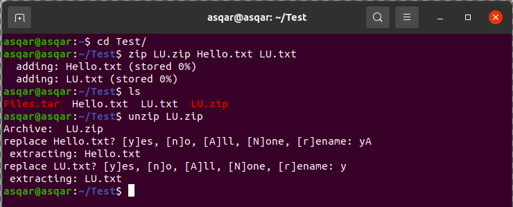

# 15. ssh command: Masofaviy serverga xavfsiz ulanish.
ssh ('Secure Shell'). Agar siz serverlarda bo'lsangiz yoki bir vaqtning o'zida bir nechta mashinalarni boshqarishingiz kerak bo'lsa, siz so'rashingiz mumkin bo'lgan yagona narsa SSH!

Agar mijoz va serverda o'rnatilgan bo'lsa va tizimga kirish uchun hisob ma'lumotlaringiz bo'lsa, tizimga osongina kirishingiz mumkin. Buning uchun ssh dan quyidagi tarzda foydalaning:

```sh
ssh username@Hostname_or_IP
```


# 16. ping command: Tarmoq orqali ikkita qurilma o'rtasidagi ulanishni sinab ko'rish.
ping('Packet Internet or Inter-Network Grope') - ulanish, kirish imkoniyati va nom ravshanligi bilan bog'liq muammolarni bartaraf etish uchun ishlatiladigan asosiy TCP/IP buyrug'idir. Parametrlarsiz foydalanilganda, bu buyruq Yordam mazmunini ko'rsatadi. Siz ushbu buyruq yordamida kompyuter nomini ham, kompyuterning IP-manzilini ham sinab ko'rishingiz mumkin.

Ping buyrug'i asosan sizda ishlaydigan internet aloqasi bor yoki yo'qligini tekshirish uchun ishlatiladi.

Agar qiziqsangiz, ping buyrug'i ko'rsatilgan xostga kichik paketlarni yuboradi, xost paketlarni oladi va javob paketlarini yuboradi, agar muvaffaqiyatli bajarilsa, ping javob paketlarini olish uchun qancha vaqt ketganini ko'rsatadi.

Va agar sizda faol internet aloqasi bo'lmasa, albatta, u ishlamaydi!

Ping buyrug'idan foydalanish uchun host IP-ni, so'ngra ping buyrug'iga bo'sh joyni ko'rsatishingiz kerak:

```sh
ping host-ip
```


# 17. su command: Boshqa foydalanuvchi hisobiga o'tish.
Linuxdagi 'su' buyrug'i foydalanuvchiga boshqa foydalanuvchi akkauntiga o'tish va uning barcha imtiyozlarini qo'lga kiritish imkonini beradi, Linuxdagi 'sudo' buyrug'i esa foydalanuvchiga boshqa foydalanuvchining imtiyozlari bilan ma'lum bir buyruqni bajarishga imkon beradi.

su('switch user'). Ko'pgina yangi boshlanuvchilar bu buyruqni bilishmaydi va ular boshqa foydalanuvchi sifatida tizimga kirishlari uchun tez-tez o'z tizimini qayta ishga tushiradilar.

Va su buyrug'idan foydalanib, siz bir nechta foydalanuvchilarni hech qanday to'xtalishlarsiz almashtirishingiz mumkin.

su buyrug'i yordamida foydalanuvchini o'zgartirish uchun u quyidagi tarzda bajarilishi kerak:

```sh
su - username
```

For example, here, I switched to the user milan:


# 18. netstat command: Tarmoq ulanishlari, marshrutlash jadvallari va tarmoq statistikasini ko'rsatish.
netstat('Network Statistics') - tarmoq ulanishlari, marshrutlash jadvallari va tarmoq interfeysi statistikasi kabi keng ko'lamli ma'lumotlarni berishi mumkin.

Netstat buyrug'idan foydalanish uchun siz berilgan sintaksisga amal qilishingiz kerak:

```sh
netstat [options]
```

Aytaylik, men tinglovchi TCP portlarini bilmoqchiman, keyin men netstatdan quyidagi tarzda foydalanaman:

```sh
netstat -lt
```

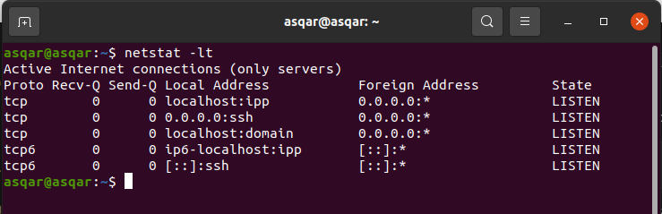

# 19. top command: Tizim resurslari va davom etayotgan jarayonlarning jonli holatini ko'rsatish.
top ('Table Of Processes') buyrug'i Linux jarayonlarini ko'rsatish uchun ishlatiladi. U ishlaydigan tizimning dinamik real vaqt rejimida ko'rinishini ta'minlaydi. Odatda, bu buyruq tizimning umumiy ma'lumotlarini va hozirda Linux yadrosi tomonidan boshqariladigan jarayonlar yoki oqimlar ro'yxatini ko'rsatadi.

Agar tizimingiz sekinlashayotgan bo'lsa, birinchi qadam fonda qancha jarayon ishlayotganini va ularning resurslar sarfini tekshirishdir.

Va bu maqsad uchun top deb nomlangan maxsus yordamchi dastur mavjud.

Yuqori buyruqni ishlatish uchun uning buyruq sintaksisiga murojaat qilishingiz mumkin:

```sh
top [options]
```

Bundan tashqari, [options] ni e'tiborsiz qoldirishingiz mumkin va parametrlarsiz bajarilganda, u davom etayotgan jarayonlarni ko'rsatadi:


# 20. free command: Tizim xotirasidan foydalanish haqidagi ma'lumotlarni ko'rsatish.
free komandasi - bu tizimingizda operativ xotira mavjudligini yoki Linux operatsion tizimining xotira statikligini tekshirish imkonini beruvchi Linux buyrug'i.
free komandasi xotira sarfini kuzatish uchun juda ko'p imkoniyatlarni taklif qiladi.

free komandadadan foydalanish uchun siz uning buyruq sintaksisiga murojaat qilishingiz mumkin:

```sh
free [options]
```

Aytaylik, men o'z tizimimdagi xotira sarfini bilmoqchiman, keyin men -h bayrog'i bilan free buyruqni ishlataman, natijani o'qish mumkin:

```sh
free -h
```


Options for free command

options        | tavsif 
-------------- | ------------
-b, – -bytes   | U xotira hajmini baytlarda ko'rsatadi.
-k, – -kilo    | U xotira hajmini kilobaytda ko'rsatadi (standart).
-m, – -mega    | U xotira hajmini megabaytda ko'rsatadi.
-g, – -giga    | U xotira hajmini gigabaytda ko'rsatadi.
– – tera       | U xotira hajmini terabaytda ko'rsatadi.
-h, – -human   | U barcha chiqish ustunlarini avtomatik ravishda eng qisqa uch xonali birlikka o'lchaydi va chop etish birliklarini ham ko'rsatadi. Amaldagi birliklar B(bayt), K(kilos), M(megas), G(gigas) va T(teras).
-c, – -count   | U chiqish c sonini ko'rsatadi va bu parametr aslida -s opsiyasi bilan ishlaydi.
-l, – -lohi    | Bu past va yuqori xotiraning batafsil statistikasini ko'rsatadi
-o, – -old     | Ushbu parametr bufer sozlangan chiziqni ko'rsatishni o'chiradi.
-s, – -seconds | Ushbu parametr s soniya kechikishdan keyin chiqishni doimiy ravishda ko'rsatishga imkon beradi. Aslida, usleepsystem call mikrosekundlik ruxsatni kechiktirish vaqtlari uchun ishlatiladi.
-t, – -total   | U ustunlar yig'indisini ko'rsatadigan chiqishda qo'shimcha qatorni qo'shadi.
– -help        | U yordam xabari va chiqishni ko'rsatadi.
-V, – -version | U versiya ma'lumotlarini va chiqishni ko'rsatadi.

# 21. df command: Diskdan foydalanish ma'lumotlarini olish.
df('disk free') - buyrug'i yordamida siz bir vaqtning o'zida har bir drayverning diskdan foydalanish ma'lumotlarini olishingiz mumkin!

df buyrug'i fayl tizimidagi umumiy joy va mavjud bo'sh joy haqidagi ma'lumotlarni ko'rsatadi. FileSystem parametri fayl tizimi joylashgan qurilma nomini, fayl tizimi o'rnatilgan katalogni yoki fayl tizimining nisbiy yo'l nomini belgilaydi.

Va df buyrug'idan foydalanish uchun siz oddiy buyruq sintaksisiga amal qilishingiz kerak bo'ladi:

```sh
df [options]
```

df buyrug'ini hech qanday variantsiz ishlatishingiz va natijani olishingiz mumkin, ammo bu shunchaki chalkash! Buni hal qilish uchun siz -h variantidan foydalanish mumkin:

```sh
df -h
```


# 22: kill command: Jarayonga jarayonni tugatadigan signal yuboradi.
Linuxda jarayonni o'chirish uchun 'kill' buyrug'idan foydalanishingiz mumkin.

'kill' buyrug'ini ishlatish uchun sizga kerak bo'lgan yagona narsa berilgan sintaksisga amal qilishdir:

```sh
kill <signal> <PID>
```

Misol uchun, agar men 3347 PIDga ega bo'lgan jarayonni o'chirmoqchi bo'lsam, men quyidagilarni ishlataman:

```sh
kill 3347
```


# 23: find command: Berilgan argumentlar asosida fayl yoki katalogni qidirad.
UNIX-dagi find buyrug'i fayllar ierarxiyasi bo'ylab yurish uchun buyruq qatori yordamchi dasturidir. Undan fayllar va kataloglarni topish va ular ustida keyingi amallarni bajarish uchun foydalanish mumkin. U fayl, papka, nom, yaratilgan sana, oʻzgartirish sanasi, egasi va ruxsatnomalari boʻyicha qidirishni qoʻllab-quvvatlaydi.

find buyrug'i Linux taklif qiladigan eng kuchli yordamchi dasturlardan biri bo'lib, agar to'g'ri ishlatilsa, u minglab fayllar to'plamidan ma'lum bir faylni topishi mumkin!

Va find buyrug'idan foydalanish uchun uni quyidagi tarzda bajarish kerak:

```sh
find [path] [expression]
```

Masalan, men bu yerda Hello.txt ni uy katalogimdan qidirdim (u rekursiv izlaydi):

```sh
find ~/ -type f -name Hello.txt
```

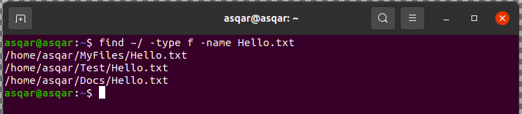

# 24: history command: Oldindan bajarilgan buyruqlar ro'yxatini oladi.
Buyruqlar tarixi ko'plab operatsion tizim qobiqlari, kompyuter algebra dasturlari va boshqa dasturiy ta'minotdagi xususiyat bo'lib, u foydalanuvchiga oldingi buyruqlarni eslab qolish, tahrirlash va qayta ishga tushirish imkonini beradi.

Agar siz kutilganidek ishlagan qimmatli buyrug'ingizni unutgan bo'lsangiz, uni 'history' buyrug'i bilan qaytarib olishingiz mumkin! Odatiy bo'lib, u oxirgi 1000 ta buyruqni saqlaydi va agar siz ko'proq saqlamoqchi bo'lsangiz, buni '.bashrc' faylini sozlash orqali ham qilishingiz mumkin.

Siz shunchaki tarixni yozishingiz mumkin va u oldingi buyruqlarning bajarilishini ko'rsatadi:

```sh
history
```

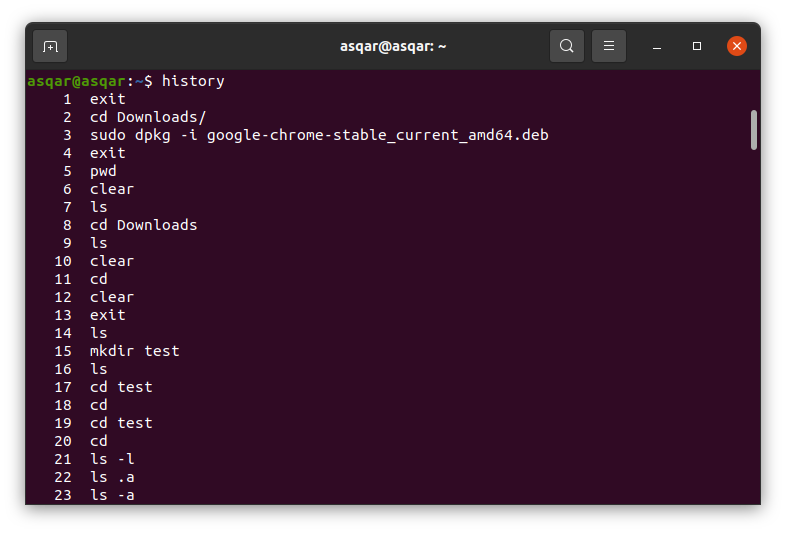

Buyruqni bilganingizdan so'ng, uning indeks raqamidan foydalanib, xuddi shunday qilishingiz mumkin.

Aytaylik, men indeks raqami 127 bo'lgan buyruqni ishga tushirmoqchiman, men qilishim kerak bo'lgan narsa raqamni !sign in terminaliga qo'shishdir:

```sh
!127
```

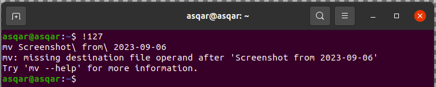

# 25: apt command: Ubuntu paket menejeri paketlarni o'rnatish, yangilash va o'chirish uchun ishlatiladi.
apt ('Advanced Package Tool') - Ubuntu ning rasmiy paket menejeri bo'lib, u paketlarni o'rnatish, yangilash va olib tashlash uchun ishlatiladi.

apt buyrug'i kuchli buyruq qatori vositasi bo'lib, u Ubuntu'ning Advanced Packaging Tool (APT) bilan ishlaydi. Apt ichidagi buyruqlar yangi dasturiy ta'minot paketlarini o'rnatish, mavjud dasturiy paketlarni yangilash, paketlar ro'yxati indeksini yangilash va hatto butun Ubuntu tizimini yangilash uchun vositalarni taqdim etadi.

Foydalanuvchilarning ko'pchiligi apt bilan tanish, chunki siz aptdan foydalanmasdan hech narsani yangilay yoki o'rnatolmaysiz.

Aytaylik, siz Vim-ni Ubuntu-ga o'rnatmoqchi bo'lsangiz, unda paket nomi bilan o'rnatish bayrog'idan foydalanishingiz kerak bo'ladi:

```sh
sudo apt install vim
```


Paketni olib tashlash uchun undan quyidagi tarzda foydalaning:

```sh
sudo apt remove package_name
```

Bundan tashqari, barcha apt paketlarini, jumladan Linux yadrosini yangilash uchun ham foydalanishingiz mumkin:

```sh
sudo apt update && sudo apt upgrade
```

