# Must know Ubuntu commands
**_And if you are curious to know what commands you must know to get the most out of your Ubuntu machine, here's a summary of what I'm about to discuss:_**

| Command	| Description                                                                    |
| --------- | -----------------------------------------------------------------------------  |
| ls        |	List the contents of the directory                                           |
| cd        |	Change to a different directory.                                             |
| mkdir     |	Create a new directory.                                                      | 
| touch     |	Create a new empty file or update the modification time of a file.           |
| cp        |	Copy a file or a directory.                                                  |
| mv        |	Can be used to move or rename a file or directory.                           | 
| nano      |	A simple text editor which can be used to create or edit files.              |
| cat       |	Shows the contents of a file.                                                |
| grep      |	Sorts the output based on a given pattern.                                   | 
| chmod     |	Change the permission of a file or a directory.                              | 
| chown     |	Change the owner of a file or a directory.                                   |
| tar       |	Create or extract a tar archive file.                                        |
| zip       |	Creates a zip file.                                                          |
| unzip     |	Extract the zip archive file.                                                | 
| ssh       |	Securely connect to a remote server.                                         | 
| ping      |	Test the connectivity between two devices over the network.                  |
| su        |	Switch to another user account.                                              |
| netstat   |	Shows network connections, routing tables, and network stats.                | 
| top       |	Shows the live status of system resources and ongoing processes.             |
| free      |	Displays the information about the system's memory usage.                    |
| df        |	Gets the disk usage information.                                             |
| kill      |	Used to kill the ongoing process.                                            |
| find      |	Searches for a file or a directory based on given arguments.                 |
| history   |	Gets the list of previously executed commands.                               | 
| apt       |	Ubuntu package manager which is used to install, update and remove packages. |

**Want to know how to use every command mentioned above with an example? Here you have it.**

## 1. ls command: List the content of the directory

This is one of the most basic commands and it is thought first if anyone is starting their Linux journey.

And when used without any options, it will list the contents of the current working directory:

```sh
ls
```

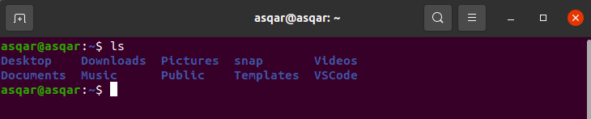

Similarly, you can use the -a option with the ls command to list hidden files:

```sh
ls -a
```

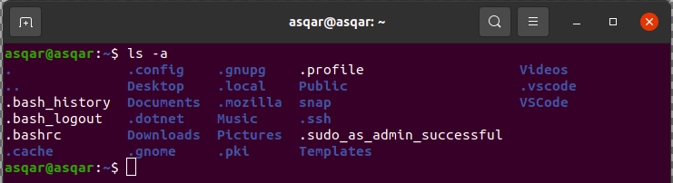

If you notice carefully, it listed files and directories starting with . which are hidden files/directories and won't be listed by default.

Want to learn more about the ls command? Here are some useful examples:

# 2. cd command: Chage to a different directory

This might be the most used command in Linux as if you are dealing with the terminal, you are required to chage the directories pretty frequently.

To use the cd command, all you have to do is append the directory name followed by space to the cd command:

```sh
cd [directory-name]
```

For your reference, here, I changed my directory to Pictures:

```sh
cd Pictures
```

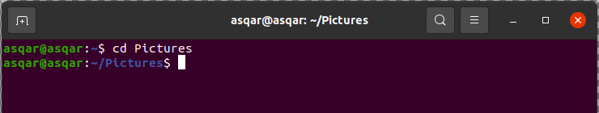

# 3. mkdir command: Create a new directory

You may want to create a new directory to store specific files inside.

And in that case, you can use the mkdir command followed by the space and name of the directory as shown:

```sh
mkdir [directory-name]
```

For example, here, I created a new directory named Examples:

```sh
mkdir Examples
```

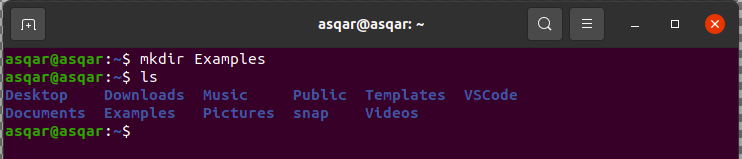

And as you can see, when I used the ls command, it showed the recently created directory.

# 4. touch command: Create empty files
In an operating system where everything is treated as a file, creating files is one of the most essential things you do with Linux.

And in the times when you want to create an empty file, you can use the touch command as shown:

```sh
touch [Filename]
```

So let's say I want to create an empty text file named Hello.txt, then, I will be using the touch command in the following manner:

```sh
touch Hello.txt
```

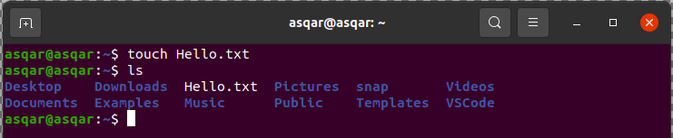

# 5. cp command: Copy files or directories

You may want to copy your files or directories from one place to another and in that case, you can utilize the cp command.

And to copy files using the cp command, it needs to be executed in the following manner:

```sh
cp source_file target_directory
```

Let's say I want to copy a text file named Hello.txt to the MyFiles directory, then, I'd have to use the following command:

```sh
cp Hello.txt MyFiles/
```

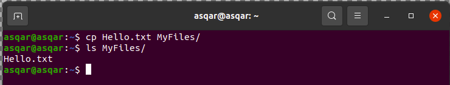

# 6. mv command: Move or rename file/directory

Previously, I explained how you can copy files using the cp command but what if you want to move them?

Well, in that case, you can use the mv command in the following manner:

```sh
mv target_file target_directory
```

For example, here, I have moved Hello.txt to the Docs directory:

```sh
mv Hello.txt Docs/
```

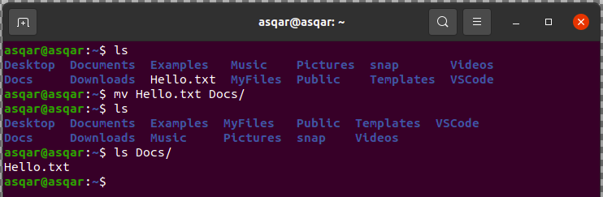

And as you can see, the file was moved successfully.

# 7. nano command: Create or edit text files easily

The nano text editor is by far the easiest text editor in the Linux terminal which can be used to create and edit the text files in Linux.

To edit the text file using nano, append the filename to the nano command followed by the space as shown:

```sh
nano Filename
```

For example, here, I made a few changes to the Hello.txt file using the nano text editor:

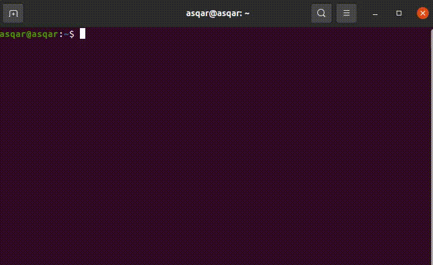

But nano can do a lot more than this!

# 8. cat command: Read a text file
In times when you want to read the content of the text file, the cat command is all you need. In simple words, it will display the text content in your standard output.

And to use the cat command, you'd need to execute it in the following manner:

```sh
cat Filename
```

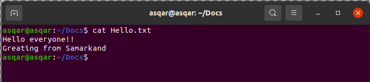

# 9. grep command: Find from the file content or command output
There are various commands that'd fill the whole screen with their output so in that case, you can use the grep command to find exactly what you were looking for.

Also, the same can be applied to files.

It can be used directly or can be piped to the existing command.

So for your reference, here, I have piped the grep command to the cat command to find the word Hello from the Hello.txt file:

```sh
cat Hello.txt | grep -w "Hello"
```

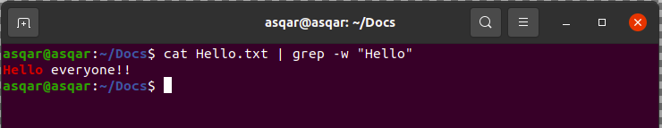

# 10. chmod command: Change file permissions
From its core, Linux is built to have multiple users and in that case, you might not want to allow other users to access your personal files.

And using the chmod command, you can change the read, write, and execution permission of a file.

To use the chmod command, you'd have to follow the given command syntax:

```sh
chmod [options] mode file(s)
```

So let's say I want to make a Hello.sh script executable, then, I will be using the following:

```sh
chmod +x Hello.sh
```

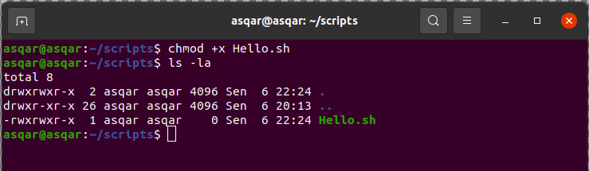

And as you can see, the file is now executable!

# 11. chown: Change file ownership
This is similar to what I explained above but using the chown, you can change the ownership of the file, and later on, you can use the chmod to change permissions for the owner (if you want to).

To use the chown command, you'd have to follow the given command syntax:

```sh
chown [OPTIONS] USER[:GROUP] file
```

For example, here, I changed the ownership of the Hello.txt to the root user:

```sh
sudo chown root Hello.txt
```

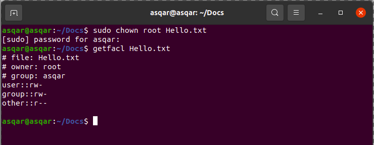

# 12. tar command: Create or extract a tar archive file
If you attempt to install packages manually in Linux, you'd get the file in the form of the tar archive in most cases.

And you can use the tar command to create or extract the tar archive files.

To do so, you'd have to use the tar command in the following manner:

```sh
tar [options] [archive_name] /target/file/or/directoty
```

For your reference, here, I created a tar file named Files.tar which contains Hello.txt and main.py:

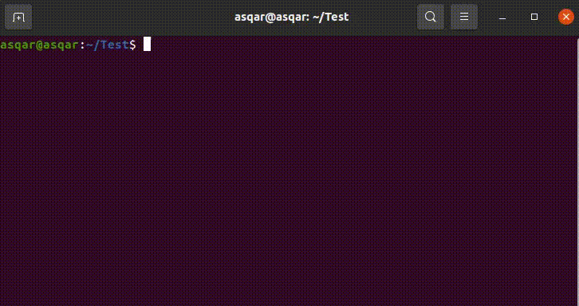

But what about extracting the tar files? Or do you want to create a tar file from a directory?

To do so, refer to our detailed guide on tar:

# 13. zip command: Create zip files
Want to create zip files? All you need is a zip command!

To create a zip file, you'd have to use the zip command in the following manner:

```sh
zip output_file.zip input_file
```

For example, here, I created a zip file named Hello.zip containing multiple files:

```sh
zip Hello.zip Hello.txt main.py
```

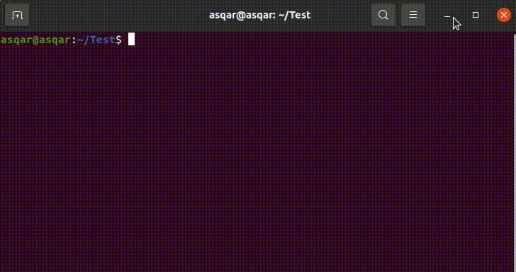

# 14. unzip command: Extract zip files
Unlike the tar command which can be used to create and extract tar files, you'd have to use the unzip command separately to extract zip files.

To unzip files using the unzip command, you'd have to follow the given syntax:

```sh
unzip [options] archive.zip
```

For your reference, here, I will unzip the LU.zip file:

```sh
unzip LU.zip
```

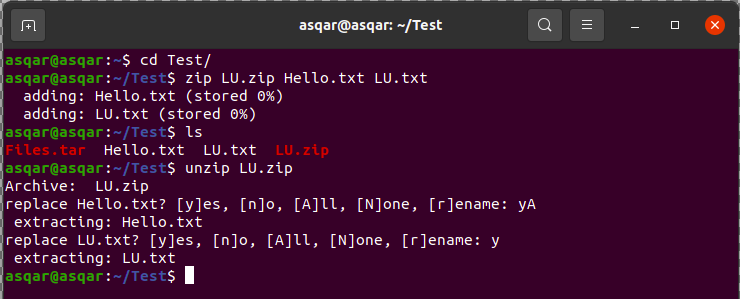

# 15. ssh command: Connect to a remote server
If you are into servers or have to manage multiple machines at the same time, SSH is all you can ever ask for!

If installed on both client and server and if you have login credentials, you can easily get into the system. To do so, use ssh in the following manner:

```sh
ssh username@Hostname_or_IP
```


# 16. ping command: Test connectivity between two hosts
The ping command is mostly used to check whether you have a working internet connection or not.

If you're curious, the ping command sends small packets to the specified host, the host will receive the packets and will send the response packets, if done successfully, the ping will show how long it took to get response packets.

And if you don't have an active internet connection, of course, it won't work!

To use the ping command, you'd have to specify the host IP followed by space to the ping command:

```sh
ping host-ip
```

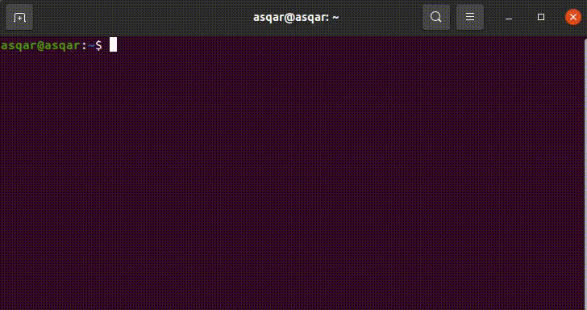

# 17. su command: Log in as another user
Many beginners are not aware of this command and they often restart their system so they can log in as another user.

And using the su command, you can switch between multiple users without any hiccups.

To change the user using the su command, it needs to be executed in the following manner:

```sh
su - username
```

For example, here, I switched to the user milan:


# 18. netstat command: Show network statistics
If you are into networking, the netstat can give a wide range of information such as network connections, routing tables, and network interface statistics.

And to use the netstat command, you'd have to follow the given syntax:

```sh
netstat [options]
```

So let's say I want to find out the listening TCP ports, then I will be using the netstat in the following manner:

```sh
netstat -lt
```


But you can do a lot more than just listing listening ports.

# 19. top command: Monitor processes and system resources
If your system is slowing down, the first step is to check how many processes are running in the background and their resource consumption.

And there is a specific utility for this purpose named top.

To use the top command, you can refer to its command syntax:

```sh
top [options]
```

You can also ignore the [options] and when executed without options, it will show the ongoing processes:

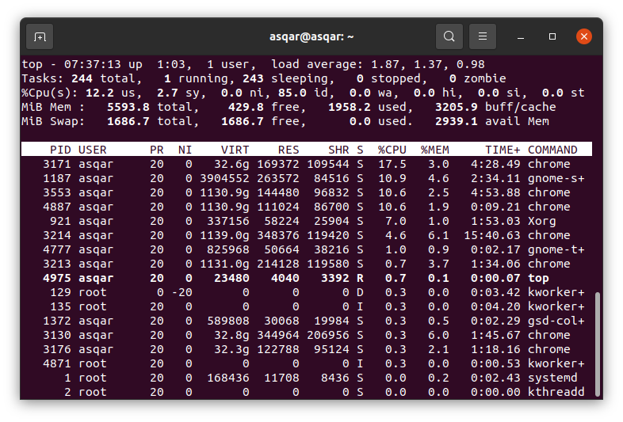

# 20. free command: Shows info about memory usage
If you are only interested in monitoring memory consumption, the free command offers plenty of options to get the job done.

To use the free command, you can refer to its command syntax:

```sh
free [options]
```

So let's say I want to know the memory consumption in my system, then I will be using the free command with the -h flag to make the output human-readable:

```sh
free -h
```

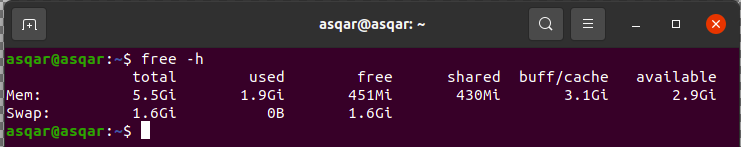

# 21. df command: Get info about disk space usage
Using the df command, you can get the disk usage info of every drive at once!

And to use the df command, you'd have to follow a simple command syntax:

```sh
df [options]
```

While you can use the df command without any options and still get the output, but is just confusing! So to deal with that, you can use the -h option:

```sh
df -h
```

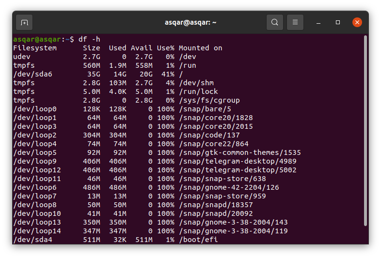

# 22: kill command: Kill the ongoing processes
If you find a stubborn process that is consuming a major chunk of your resource, killing it is the best way to get a smooth experience.

To do so, you can use the kill command to shut down the process in Linux.

And to use the kill command, all you need to do is follow the given syntax:

```sh
kill <signal> <PID>
```

For example, if I want to kill the process having PID of 3347, then I will be using the following:

```sh
kill 3347
```

If you notice, I didn't use any options as by default, it uses the TERM signal which is the recommended way to kill the process.

But if it is not working, you can use other signals like SIGKILL,  SIGQUIT, etc. and to learn more about how signals work, you can refer to our detailed guide:

# 23: find command: Search for files and directories
The find command is one of the most powerful utilities that Linux has to offer if used correctly, it can find the specific file from a stack of thousand of files!

And to use the find command, it needs to be executed in the following manner:

```sh
find [path] [expression]
```

For example, here, I searched for Hello.txt inside my home directory (it will search recursively) :

```sh
find ~/ -type f -name Hello.txt
```

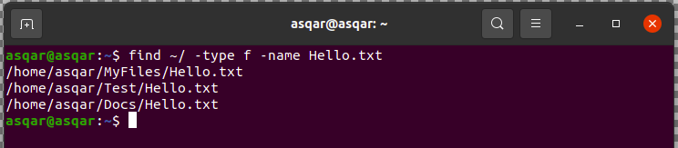

But that's not even the tip of the iceberg! There are multiple ways to use the find command such as using the find command with exec.

And if you want to learn more, here are some practical examples of the find command:

# 24: history command: List the preciously used commands
If you forgot that precious command of yours that worked as expected, you can get it back with the history command!

By default, it will store the last 1000 commands and if you want to store more, you can do that too by tweaking the .bashrc file.

You can simply type the history and it will show the previous command executions:

```sh
history
```

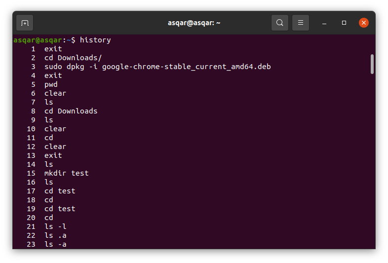

Once you find out the command, you can execute the same by just using its index number.

So let's say I want to run the command having the index number 127, all I have to do is append the number to the !sign in terminal:

```sh
!127
```

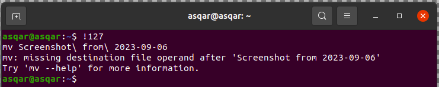

# 25: apt command: Install, update, and remove packages
Apt is the official package manager of Ubuntu and it is used to install, update and remove the packages.

And most of the users are familiar with the apt as you can't even update or install anything without using the apt.

So let's say you want to install Vim in Ubuntu, then you'd have to use the install flag with the package name:

```sh
sudo apt install vim
```

To remove a package, use it like this:

```sh
sudo apt remove package_name
```

You can also use it to update all the apt packages, including the Linux kernel:

```sh
sudo apt update && sudo apt upgrade
```

But being a package manager, there are tonnes of other options, and not possible to include them here.

# Get started with Linux commands

If you are absolutely new to the terminal, you must refer to this article and learn the essential tips.